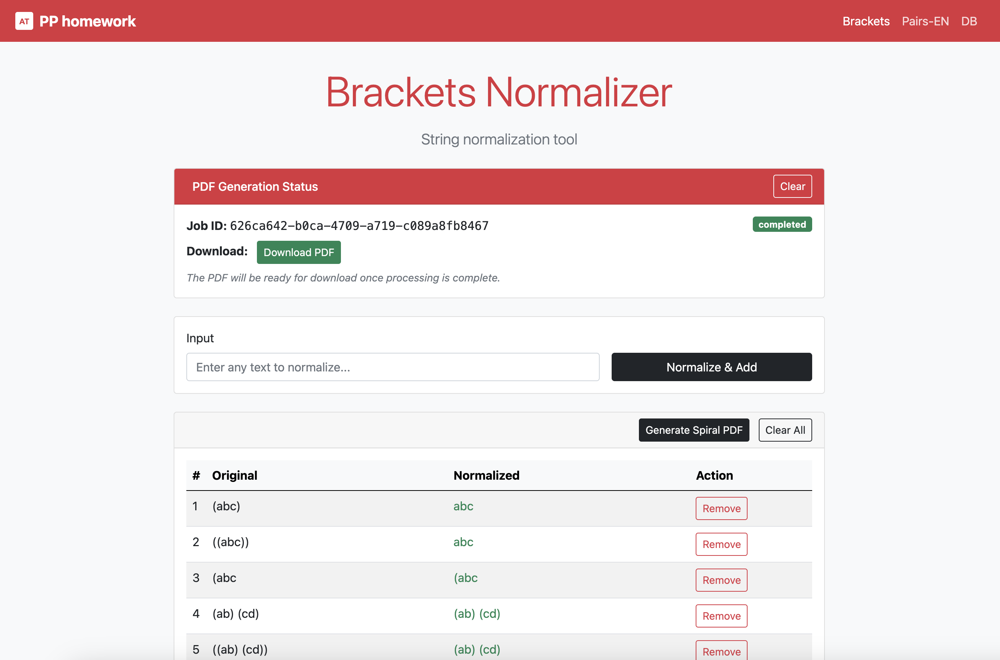

# PP Homework

Sviluppo di un'applicazione web completa che implementa tre funzionalità principali: pulizia di stringhe con rimozione di parentesi, rimozione di coppie di lettere inglesi, e generazione asincrona di PDF con layout a spirale.


*Anteprima dell'interfaccia web dell'applicazione*

## 🎯 Scelte Tecniche

### Frontend: JavaScript Vanilla
Pur riconoscendo che **Vue.js + Vite** sarebbe stata la scelta ideale per un frontend moderno e reattivo, ho optato per **JavaScript vanilla** per rispettare i vincoli della consegna che richiedeva di non utilizzare framework MVC/MVVM. Questa scelta ha permesso di:
- Mantenere il codice semplice e diretto
- Concentrarsi sui task richiesti senza complessità aggiuntive
- Dimostrare competenze JavaScript pure

### Backend: Node.js + Express
Ho scelto **Node.js con Express** per implementare un backend veloce e efficiente, sempre in linea con i requisiti della consegna. Questa combinazione offre:
- Sviluppo rapido e prototipazione veloce
- Gestione asincrona nativa per la generazione PDF

### Parallelismo: Worker Threads
Nonostante Node.js sia single-threaded con I/O multi-thread, ho implementato **Worker Threads** per ottenere un vero parallelismo durante la creazione dei PDF. Questo garantisce:
- Thread principale sempre responsivo
- Generazione PDF non bloccante
- Possibilità di elaborare più PDF simultaneamente

## 📋 Task Completati

### Task 1: Cleaning - Rimozione Parentesi e Coppie di Lettere

#### 1.1 Pagina Brackets (`/brackets`)
Implementata una pagina web che permette all'utente di inserire stringhe e rimuoverne tutte le parentesi tonde esterne corrispondenti.

**Implementazione:** Algoritmo iterativo che rimuove solo le parentesi esterne bilanciate, preservando quelle interne o non bilanciate.
- **Soluzione implementata in:** `app/public/js/brackets.js` nella funzione `normalizeBrackets()`

#### 1.2 Pagina Pairs-EN (`/pairs-en`) - Bonus Point
Implementata la funzionalità bonus per rimuovere coppie di lettere inglesi esterne.

**Implementazione:** Algoritmo iterativo che utilizza una mappa per le coppie di lettere, garantendo performance ottimali con lookup O(1). Un'alternativa con regex sarebbe stata possibile ma meno performante.
- **Soluzione implementata in:** `app/public/js/pairs-en.js` nella funzione `normalizePairsEN()`

### Task 2: Generazione PDF con Layout a Spirale

Implementata la generazione asincrona di PDF con layout a spirale per entrambe le pagine di cleaning. Le caratteristiche principali includono:

#### 2.1 Processo Asincrono
- **Generazione non sincrona:** Il PDF viene generato in background utilizzando Worker Threads
- **Link di download:** L'utente riceve un link per scaricare il PDF una volta completato
- **Persistenza sessione:** L'utente può chiudere la pagina e tornare successivamente per scaricare il PDF

#### 2.2 Layout a Spirale
Il layout segue il pattern mostrato nel file [`demo`](app/demo_spiral.pdf), che rappresenta un esempio di risultato prodotto dall'algoritmo implementato:

**Algoritmo implementato:**
- Punto di partenza: centro della spirale con marcatore `>>> |`
- Direzioni di crescita: TOP → LEFT → BOTTOM → RIGHT
- Separatori: linee tratteggiate per delimitare le sezioni
- Font: Courier per mantenere allineamento monospace
- **Soluzione implementata in:** `app/services/spiralGenerator.js` nel metodo `generateSpiral()`

### Task 3: Architettura

#### 3.1 Architettura Attuale (Docker)
L'applicazione utilizza un'architettura containerizzata con:
- **App Container:** Node.js + Express per API e frontend
- **MongoDB Container:** Database per gestione coda job PDF
- **Worker Threads:** Parallelismo per generazione PDF CPU-intensiva
- **File System:** Storage locale per PDF generati

## 📁 Struttura del Progetto

```
.
├── app/                           # Applicazione Node.js
│   ├── public/                    # File statici HTML/CSS/JS
│   │   ├── js/                    # Moduli JavaScript frontend
│   │   │   ├── api.js             # Layer di comunicazione API
│   │   │   ├── brackets.js        # Modulo normalizzatore brackets
│   │   │   ├── pairs-en.js        # Modulo normalizzatore coppie inglesi
│   │   │   ├── normalize-utils.js # Utilità condivise per normalizzazione
│   │   │   └── pdf-utils.js       # Utilità per gestione PDF
│   │   ├── index.html             # Pagina iniziale con riferimenti alle pagine di normalizzazione
│   │   ├── brackets.html          # Pagina normalizzatore brackets
│   │   ├── pairs-en.html          # Pagina normalizzatore Pairs-EN
│   │   └── favicon.svg            # Icona del sito
│   ├── services/                  # Servizi backend
│   │   ├── index.js               # Esportazione centralizzata servizi
│   │   ├── pdfWorker.js           # Generazione PDF con Worker Threads
│   │   ├── queueProcessor.js      # Gestione coda job
│   │   └── spiralGenerator.js     # Generatore layout a spirale
│   ├── models/                    # Modelli database
│   │   ├── index.js               # Esportazione centralizzata modelli
│   │   └── PDFJob.js              # Modello job PDF
│   ├── routes/                    # Route API Express
│   ├── config/                    # File di configurazione
│   │   └── database.js            # Configurazione MongoDB
│   ├── pdfs/                      # Storage locale PDF generati
│   ├── .dockerignore              # File ignorati da Docker
│   ├── Dockerfile                 # Configurazione container
│   ├── package.json               # Dipendenze Node.js
│   └── server.js                  # Server Express principale
├── pdfs/                          # Storage esterno PDF generati
├── docker-compose.yml             # Orchestrazione Docker Compose
├── .gitignore                     # File ignorati da Git
└── README.md                      # Questo file
```

## 🛠️ Tecnologie

- **Backend**: Node.js con Express e Worker Threads
- **Frontend**: JavaScript vanilla (ES6 modules)
- **UI Framework**: Bootstrap 5 (versione compilata via CDN)
- **Database**: MongoDB (NoSQL) per gestione code job
- **Containerizzazione**: Docker e Docker Compose
- **PDF Generation**: PDFKit library

## 🚀 Avvio Rapido

### Prerequisiti
- Docker e Docker Compose installati
- Porte 3001 e 27017 libere sul sistema

### Avvio dell'applicazione
```bash
# Costruisci e avvia i container
docker-compose build
docker-compose up -d

# In un nuovo terminale, avvia l'applicazione Node.js
docker-compose exec app npm start

# Ferma tutti i servizi
docker-compose down
```

## 🔍 Debug & Monitoraggio
- `GET /api/debug/jobs` - Tutti i job con tempi di elaborazione
- `GET /health` - Health check

## 🔧 Test e Validazione (nice to have)

- **Test automatici:** Implementazione di test unitari per validare le funzioni di pulizia stringhe e generazione spirale (nice to have per garantire robustezza del codice)

## ☁️ Migrazione al Cloud

Per la migrazione al cloud e la gestione di migliaia di utenti in modo scalabile, la soluzione proposta utilizza l'ecosistema **AWS** con architettura serverless.


*Diagramma dell'architettura cloud sviluppato con Excalidraw*

### 🌐 Frontend (Client-Side)

Nella proposta di migrazione cloud, il frontend verrebbe ospitato su S3 come sito web statico e distribuito tramite CloudFront per performance globali. AWS WAF proteggerebbe da attacchi comuni del OWASP Top 10 come DDoS e SQL injection.

Questa parte coprirebbe completamente i primi due task (brackets e pairs-en): essendo operazioni di manipolazione stringhe che non richiedono elaborazione server-side, verrebbero eseguite interamente nel browser, sfruttando la potenza di calcolo del client e riducendo i costi operativi.

### ⚡ Backend (Server-Side)

Il backend utilizzerebbe AWS Lambda per la generazione PDF serverless, con API Gateway come punto di ingresso protetto da WAF. 

Amazon SQS gestirebbe la coda di elaborazione per disaccoppiare richieste e processing. I PDF verrebbero salvati in un bucket S3 privato, accessibili solo tramite URL firmati temporanei.

DynamoDB servirebbe per il tracking dei job e le referenze ai PDF generati.

### 📄 Generazione PDF

Quando l'utente richiede un PDF, API Gateway inoltra la richiesta a una Lambda che registra il job in SQS e DynamoDB, restituendo un ID univoco al frontend.

Lambda worker leggono dalla coda SQS, generano i PDF e li salvano in S3, aggiornando lo stato in DynamoDB. Il frontend può interrogare periodicamente DynamoDB tramite la prima Lambda o una dedicata per verificare il completamento e ottenere il link di download tramite URL firmato.

*Nota: Il polling può essere sostituito con tecniche come WebSocket, ma per questo tipo di attività dovrebbe essere sufficiente senza overenginerizzare.*

### 🔐 Add-on Sicurezza

JWT per l'autenticazione API, Amazon Cognito per la gestione utenti completa.

### 📈 Vantaggi Scalabilità

Auto-scaling automatico delle Lambda, costi pay-per-use proporzionali all'utilizzo, e zero maintenance dell'infrastruttura.

---

Made with ❤️ by [Alessandro Tolomio](https://www.linkedin.com/in/alessandro-tolomio-3b443063/)