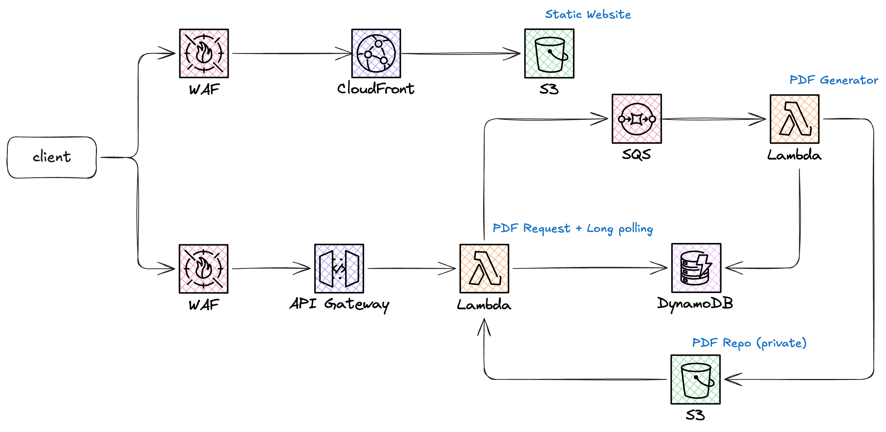

# PP Homework

Sviluppo di un'applicazione web completa che implementa tre funzionalità principali: pulizia di stringhe con rimozione di parentesi, rimozione di coppie di lettere inglesi, e generazione asincrona di PDF con layout a spirale.

## 🎯 Scelte Tecniche

### Frontend: JavaScript Vanilla
Pur riconoscendo che **Vue.js + Vite** sarebbe stata la scelta ideale per un frontend moderno e reattivo, ho optato per **JavaScript vanilla** per rispettare i vincoli della consegna che richiedeva di non utilizzare framework MVC/MVVM. Questa scelta ha permesso di:
- Mantenere il codice semplice e diretto
- Concentrarsi sui task richiesti senza complessità aggiuntive
- Dimostrare competenze JavaScript pure

### Backend: Node.js + Express
Ho scelto **Node.js con Express** per implementare un backend veloce e efficiente, sempre in linea con i requisiti della consegna. Questa combinazione offre:
- Sviluppo rapido e prototipazione veloce
- Gestione asincrona nativa per la generazione PDF

### Parallelismo: Worker Threads
Nonostante Node.js sia single-threaded con I/O multi-thread, ho implementato **Worker Threads** per ottenere un vero parallelismo durante la creazione dei PDF. Questo garantisce:
- Thread principale sempre responsivo
- Generazione PDF non bloccante
- Possibilità di elaborare più PDF simultaneamente

## 📋 Task Completati

### Task 1: Cleaning - Rimozione Parentesi e Coppie di Lettere

#### 1.1 Pagina Brackets (`/brackets`)
Implementata una pagina web che permette all'utente di inserire multiple stringhe (una per riga) e rimuovere tutte le parentesi tonde esterne corrispondenti.

**Implementazione:** Algoritmo iterativo che rimuove solo le parentesi esterne bilanciate, preservando quelle interne o non bilanciate.

#### 1.2 Pagina Pairs-EN (`/pairs-en`) - Bonus Point
Implementata la funzionalità bonus per rimuovere coppie di lettere inglesi esterne corrispondenti secondo la mappatura:
`a-z, b-y, c-x, d-w, e-v, f-u, g-t, h-s, i-r, j-q, k-p, l-o, m-n`

**Implementazione:** Algoritmo iterativo che utilizza una mappa per le coppie di lettere, garantendo performance ottimali con lookup O(1). Un'alternativa con regex sarebbe stata possibile ma meno performante.

### Task 2: Generazione PDF con Layout a Spirale

Implementata la generazione asincrona di PDF con layout a spirale per entrambe le pagine di cleaning. Le caratteristiche principali includono:

#### 2.1 Processo Asincrono
- **Generazione non sincrona:** Il PDF viene generato in background utilizzando Worker Threads
- **Link di download:** L'utente riceve un link per scaricare il PDF una volta completato
- **Persistenza sessione:** L'utente può chiudere la pagina e tornare successivamente per scaricare il PDF

#### 2.2 Layout a Spirale
Il layout segue il pattern mostrato nel file [`demo`](app/demo_spiral.pdf), che rappresenta un esempio di risultato prodotto dall'algoritmo implementato:

**Algoritmo implementato:**
- Punto di partenza: centro della spirale con marcatore `>>> |`
- Direzioni di crescita: TOP → LEFT → BOTTOM → RIGHT
- Separatori: linee tratteggiate per delimitare le sezioni
- Font: Courier per mantenere allineamento monospace
- Bonus simpatia: testa della chiocciola 🐌

### Task 3: Architettura

#### 3.1 Architettura Attuale (Docker)
L'applicazione utilizza un'architettura containerizzata con:
- **App Container:** Node.js + Express per API e frontend
- **MongoDB Container:** Database per gestione coda job PDF
- **Worker Threads:** Parallelismo per generazione PDF CPU-intensiva
- **File System:** Storage locale per PDF generati

## 📁 Struttura del Progetto

```
.
├── app/                      # Applicazione Node.js
│   ├── public/               # File statici HTML/CSS/JS
│   │   ├── js/               # Moduli JavaScript frontend
│   │   │   ├── app.js        # Generatore PDF principale con auto-refresh
│   │   │   ├── api.js        # Layer di comunicazione API
│   │   │   ├── brackets.js   # Modulo normalizzatore brackets
│   │   │   └── pairs-en.js   # Modulo normalizzatore coppie inglesi
│   │   ├── index.html        # Pagina generatore PDF principale
│   │   ├── brackets.html     # Pagina normalizzatore brackets
│   │   └── pairs-en.html     # Pagina normalizzatore Pairs-EN
│   ├── services/             # Servizi backend
│   │   ├── pdfWorker.js      # Generazione PDF con Worker Threads
│   │   ├── pdfGenerator.js   # Generatore legacy single-thread
│   │   └── queueProcessor.js # Gestione coda job
│   ├── models/               # Modelli database
│   ├── routes/               # Route API
│   ├── config/               # File di configurazione
│   ├── Dockerfile            # Configurazione container
│   └── test-worker.js        # Script test worker threads
├── pdfs/                     # Storage locale per file PDF generati
├── docker-compose.yml        # Orchestrazione Docker Compose
└── README.md                 # Questo file
```

## 🛠️ Tecnologie

- **Backend**: Node.js con Express e Worker Threads
- **Frontend**: JavaScript vanilla (ES6 modules)
- **Database**: MongoDB (NoSQL) per gestione code job
- **Containerizzazione**: Docker e Docker Compose
- **PDF Generation**: PDFKit library

## 🚀 Avvio Rapido

### Prerequisiti
- Docker e Docker Compose installati
- Porte 3001 e 27017 libere sul sistema

### Avvio dell'applicazione
```bash
# Costruisci e avvia i container
docker-compose build
docker-compose up -d

# In un nuovo terminale, avvia l'applicazione Node.js
docker-compose exec app npm start

# Ferma tutti i servizi
docker-compose down
```

## Debug & Monitoraggio
- `GET /api/debug/jobs` - Tutti i job con tempi di elaborazione
- `GET /health` - Health check

## 🔧 Test e Validazione

- **Test automatici:** Implementazione di test unitari per validare le funzioni di pulizia stringhe e generazione spirale (nice to have per garantire robustezza del codice)

## ☁️ Migrazione al Cloud

Per la migrazione al cloud e la gestione di migliaia di utenti in modo scalabile, la soluzione ideale utilizza l'ecosistema **AWS** con architettura serverless.


*Diagramma dell'architettura cloud sviluppato con Excalidraw*

### 🌐 Frontend (Client-Side)
- **S3 Static Website:** Hosting del frontend come sito web statico
- **CloudFront:** CDN globale per caching e performance multinodo
- **WAF:** Protezione da bot e possibili attacchi DDoS/SQL injection

Questa configurazione copre già completamente gli esercizi della **prima consegna** (brackets e pairs-en) che vengono eseguiti interamente dal client.

### ⚡ Backend (Server-Side) 
- **API Gateway:** Endpoint REST protetti da WAF per le richieste PDF
- **Lambda Functions:** Generazione PDF serverless
- **SQS:** Coda asincrona per gestire le richieste di generazione PDF
- **S3 Private Bucket:** Storage sicuro per i PDF generati (senza accesso pubblico)
- **DynamoDB:** Tracking delle richieste per supportare long polling del frontend

### 🔄 Flusso Asincrono
1. Frontend invia richiesta PDF → API Gateway
2. Lambda registra job in SQS e DynamoDB
3. Lambda worker legge da SQS in modo asincrono
4. PDF generato e salvato in S3 privato
5. Frontend effettua long polling su DynamoDB per stato job
6. Download PDF tramite URL firmato temporaneo

### 🔐 Add-on Sicurezza
- **JWT Authentication:** Controllo accessi alle API
- **Amazon Cognito:** Sistema di autenticazione completo per il sito web
- **IAM Roles:** Controllo granulare dei permessi AWS

### 📈 Vantaggi Scalabilità
- **Auto-scaling:** Lambda gestisce automaticamente migliaia di richieste simultanee
- **Pay-per-use:** Costi proporzionali all'utilizzo effettivo
- **Zero maintenance:** Nessuna gestione server o infrastruttura